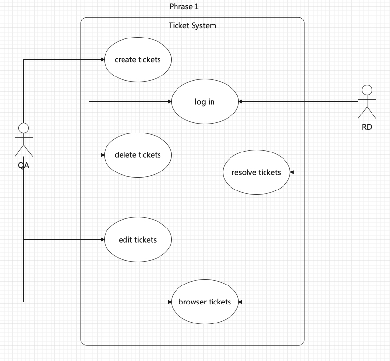
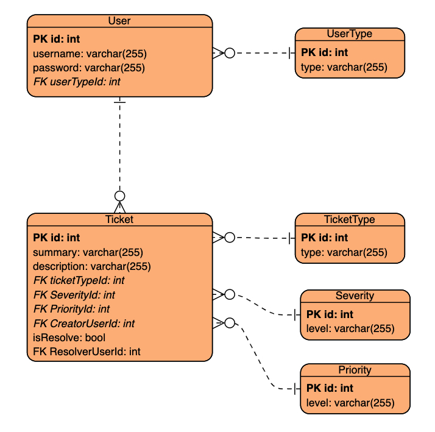
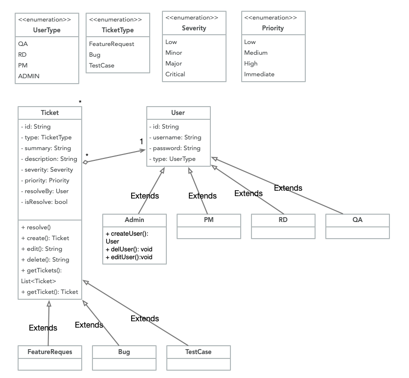
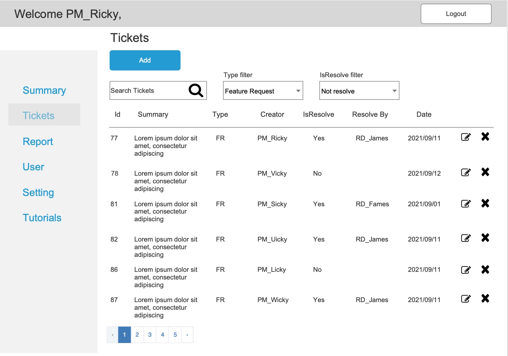
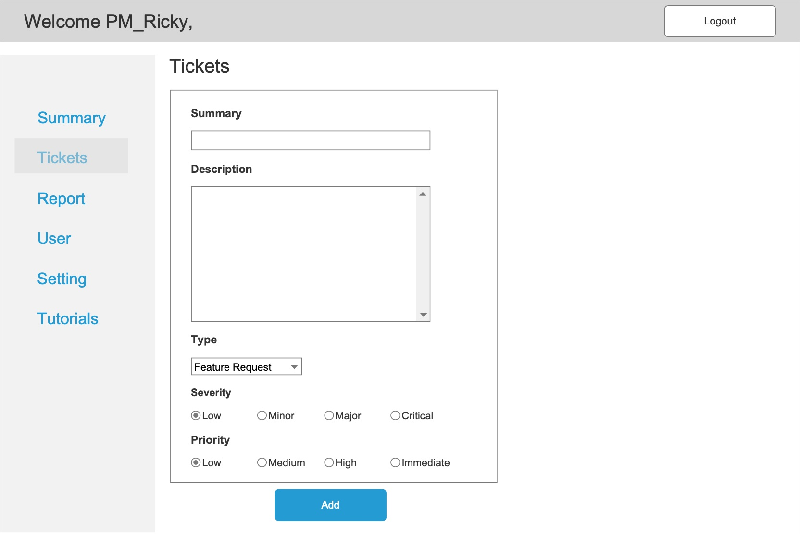

### It is a ticket tracking system. This system allows QA to report a bug and RD can mark a bug as resolved.
- There are two types of user: QA and RD.
- Only QA can create a bug, edit a bug and delete a bug.
- Only RD can resolve a bug.
- Summary field and Description filed are required of a bug when QA is creating a bug.

### Backend: .NET core 5.0 MVC Web api + JWT authentication + authorization + SQL SERVER 2019 Docker
### Frontend: React

### Task 1 - The use cases.
Phase I

### Phase II
#### Bug Ticket:
- created, edited, deleted by QA and Admin
- read by QA, RD, PM, Admin
- resolved by RD
#### Feature Request Ticket: 
- created, edited, deleted by PM and Admin
- read by QA, RD, PM, Admin
- resolved by RD
#### Test Case Ticket:
- created, edited, deleted by QA and Admin
- read by QA, RD, PM, Admin
- resolved by QA
#### User management:
- created, edited, deleted by Admin
- read by Admin

### Task 3 - System design
#### data model

#### class diagram

#### UI mock up

### Design the Web API(Json format) 